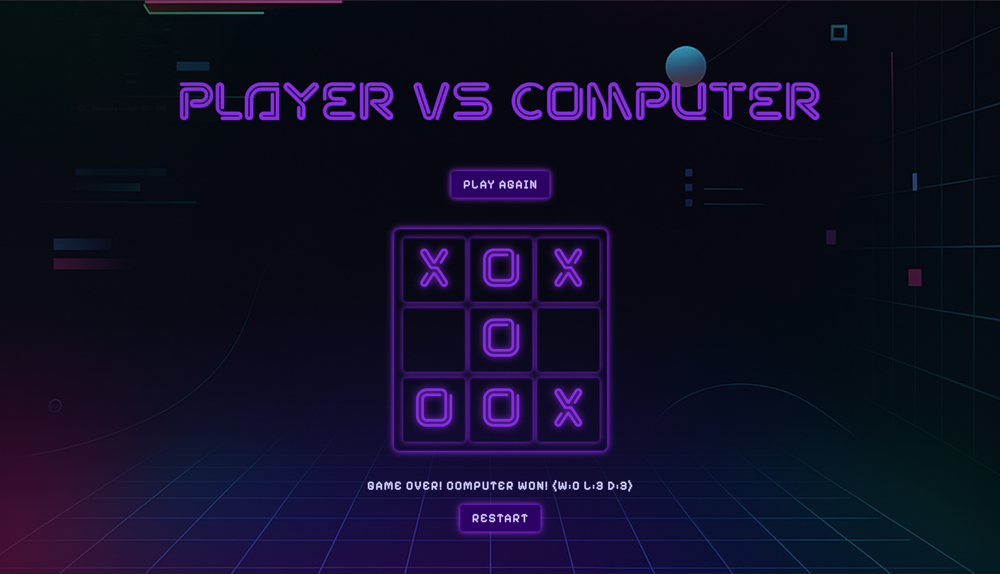

# 🎮 TicTacToe Game - AI-Powered Web Application

A modern, futuristic TicTacToe game built with Flask and featuring an intelligent AI opponent using the Minimax algorithm. Experience both Player vs Player and Player vs Computer modes with a stunning neon-themed UI.

   




## ✨ Features

### 🎯 **Game Modes**
- **Player vs Player (PvP)** - Two human players compete
- **Player vs Computer (PvE)** - Challenge an AI opponent powered by Minimax algorithm

### 🤖 **AI Intelligence**
- **Minimax Algorithm** - Unbeatable AI that calculates optimal moves
- **Heuristic Evaluation** - Advanced board position scoring
- **Perfect Play** - AI never loses, only wins or draws

### 🎨 **Modern UI/UX**
- **Futuristic Neon Theme** - Purple and cyan color scheme with glowing effects
- **Responsive Design** - Works perfectly on desktop, tablet, and mobile
- **Smooth Animations** - Hover effects and loading states
- **Custom Fonts** - NEON WORLD DEMO and Pixelify Sans typography

### 📊 **Game Statistics**
- **Persistent Tracking** - Win/loss/draw statistics saved in localStorage
- **Real-time Display** - Live stats shown during gameplay
- **Session Memory** - Statistics persist between browser sessions

### 🛡️ **Robust Architecture**
- **Input Validation** - Comprehensive server-side validation
- **Error Handling** - Graceful error recovery and user feedback
- **Security** - Protected against malicious input
- **Mobile Optimized** - Responsive design for all screen sizes

## 🚀 Quick Start

### Prerequisites
- Python 3.7 or higher
- pip (Python package manager)

### Installation

1. **Clone the repository**
   ```bash
   git clone <repository-url>
   cd TicTacToe
   ```

2. **Install dependencies**
   ```bash
   pip install flask
   ```

3. **Run the application**
   ```bash
   python app.py
   ```

4. **Open your browser**
   Navigate to `http://localhost:5000`

## 🎮 How to Play

### Player vs Player Mode
1. Click "Player vs Player" on the homepage
2. Players take turns clicking empty cells
3. First to get 3 in a row (horizontal, vertical, or diagonal) wins
4. Click "Restart Game" to play again

### Player vs Computer Mode
1. Click "Player vs Computer" on the homepage
2. Choose your symbol (X or O)
3. Select who goes first (Player or Computer)
4. Click "Start Game"
5. Make your moves by clicking empty cells
6. The AI will automatically make its move
7. Game ends when someone wins or the board is full

## 🧠 AI Algorithm: Minimax

The computer opponent uses the **Minimax algorithm** with **alpha-beta pruning** for optimal performance.

### How Minimax Works

```python
def minimax(self, state, depth, player):
    """
    Minimax algorithm implementation
    - state: current board state
    - depth: remaining moves (0-9)
    - player: current player (+1 for AI, -1 for human)
    """
    if player == self.game.comp:
        best = [-1, -1, -infinity]  # Maximizing player
    else:
        best = [-1, -1, +infinity]  # Minimizing player
    
    if depth == 0 or self.game.game_over(state):
        score = self.game.evaluate(state)
        return [-1, -1, score]
    
    for cell in self.game.empty_cells(state):
        x, y = cell[0], cell[1]
        state[x][y] = player
        score = self.minimax(state, depth - 1, -player)
        state[x][y] = 0
        score[0], score[1] = x, y
        
        if player == self.game.comp:
            if score[2] > best[2]:
                best = score
        else:
            if score[2] < best[2]:
                best = score
                
    return best
```

### Heuristic Evaluation

The AI uses a sophisticated evaluation function that considers:
- **Row patterns** - Counts symbols in each row
- **Column patterns** - Counts symbols in each column  
- **Diagonal patterns** - Counts symbols in both diagonals
- **Strategic positioning** - Values center and corner positions

```python
def evaluate(self, state):
    """
    Heuristic evaluation of board position
    Returns positive score for AI advantage, negative for human advantage
    """
    score = 0
    player = self.comp
    other_player = self.human
    
    # Evaluate rows, columns, and diagonals
    for i in range(3):
        player_score = sum(state[i][j] == player for j in range(3))
        opponent_score = sum(state[i][j] == other_player for j in range(3))
        score += self.heuristic[player_score][opponent_score]
    
    return score
```

## 🏗️ Architecture

### Backend (Flask)
```
app.py                 # Main Flask application
├── /                 # Homepage route
├── /pvp             # Player vs Player mode
├── /pve             # Player vs Computer setup
└── /pve/play        # Game move processing

tictactoe.py          # Core game logic
├── TicTacToe class  # Game state management
├── goal_test()      # Win condition checking
├── evaluate()       # Position evaluation
└── empty_cells()    # Available moves

minimax.py            # AI implementation
├── MiniMaxAgent     # AI agent class
├── minimax()        # Core algorithm
└── play()           # Move execution
```

### Frontend (JavaScript + CSS)
```
static/
├── pvp.js           # Player vs Player logic
├── pve.js           # Player vs Computer logic
├── styleIndex.css   # Homepage styling
├── style1.css       # PvP mode styling
├── style2.css       # PvE mode styling
└── fonts/           # Custom fonts

templates/
├── base.html        # Base template
├── index.html       # Homepage
├── pvp.html         # PvP game page
└── pve.html         # PvE game page
```

## 🎨 Styling & Design

### Color Scheme
- **Primary Purple**: `#8A2BE2` - Titles and highlights
- **Deep Purple**: `#2D0066` - Backgrounds and borders
- **Light Purple**: `#CECEFF` - Text and accents
- **Cyan**: `#00FFFF` - Secondary highlights

### Typography
- **Titles**: NEON WORLD DEMO (custom font)
- **Body Text**: Pixelify Sans (Google Fonts)
- **Fallback**: System fonts for compatibility

### Responsive Design
- **Desktop**: Full-size game board with hover effects
- **Tablet**: Optimized layout with adjusted sizing
- **Mobile**: Touch-friendly interface with larger buttons

## 🔧 Technical Features

### Error Handling
- **Client-side**: Comprehensive error catching and user feedback
- **Server-side**: Input validation and graceful error responses
- **Network**: HTTP status checking and retry mechanisms

### Performance Optimizations
- **Efficient Algorithm**: Minimax with depth limiting
- **Cached Evaluation**: Pre-computed heuristic tables
- **Minimal DOM Updates**: Optimized UI rendering

### Security Features
- **Input Validation**: Server-side data sanitization
- **XSS Protection**: Proper HTML escaping
- **CSRF Protection**: Flask's built-in security

## 📱 Mobile Support

The game is fully responsive and optimized for mobile devices:

- **Touch-friendly** buttons and game cells
- **Responsive grid** that adapts to screen size
- **Optimized typography** for readability
- **Gesture support** for smooth interaction

## 🎯 Game Statistics

Track your performance with persistent statistics:

- **Wins**: Games won against the AI
- **Losses**: Games lost to the AI  
- **Draws**: Games that ended in a tie
- **Total Games**: Overall games played

Statistics are automatically saved to localStorage and persist between sessions.

---

**Enjoy playing TicTacToe with AI! 🎮✨**

